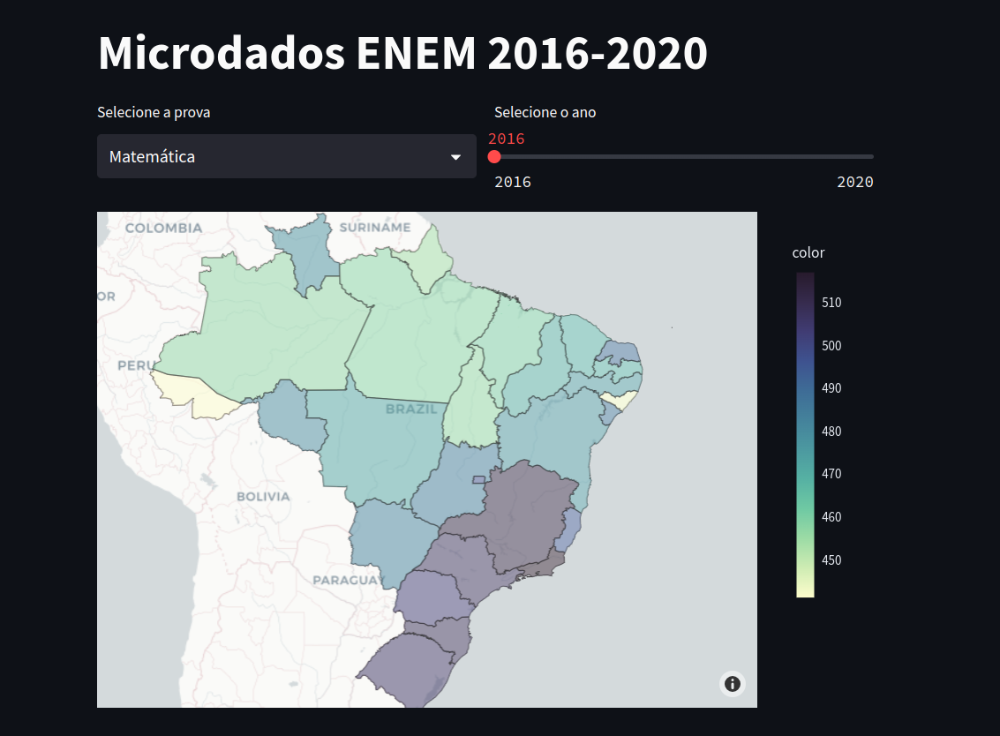
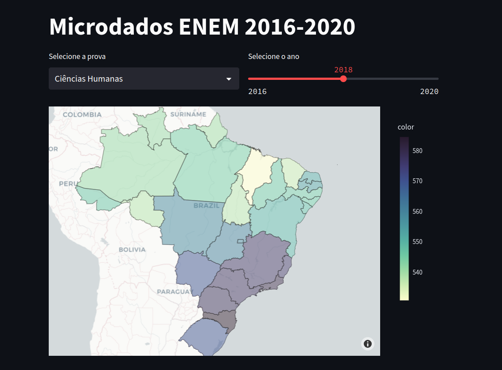
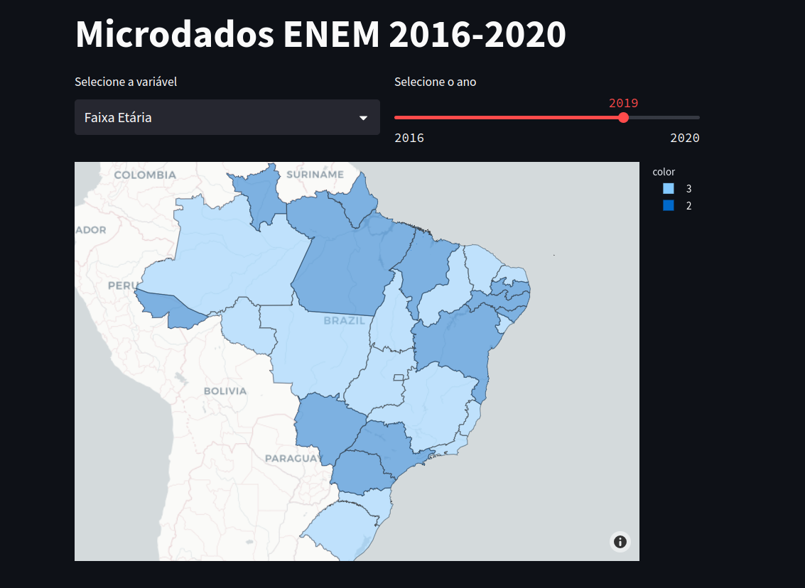
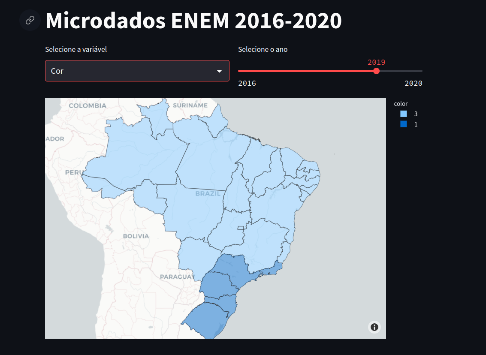
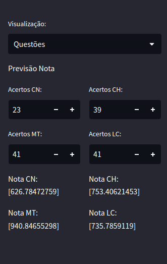

# ENEM Dashboard

## Overview
The ENEM Dashboard is an interactive data visualization tool built with Streamlit that analyzes Brazilian National High School Exam (ENEM) data from 2016 to 2020. ENEM is Brazil's primary standardized test for university admissions, making this dashboard valuable for educators, researchers, and policymakers interested in educational trends and outcomes.

## Features

### Data Visualization
- **Geographic Distribution**: Interactive maps showing average scores across Brazilian states
- **Score Analysis**:
  - Average scores by exam type (Mathematics, Natural Sciences, Languages, Human Sciences)
  - Score distribution visualizations for each exam type
  - Year-over-year score comparisons (2016-2020)

### Demographic Insights
- **Population Statistics**:
  - Race and age distribution by state and year
  - Socioeconomic analysis using violin plots
  - Wealth strata correlation with performance

### Question Analysis
- **Difficulty Metrics**:
  - Question difficulty assessment for each exam type
  - Year-by-year difficulty comparisons
  - Subject-specific question analysis

### Score Predictor
- **Machine Learning Model**:
  - Score prediction using Multilayer Perceptrons (MLPs)
  - Based on number of correct answers per subject
  - Individual subject score estimates

## Installation

### Prerequisites
- Python 3.7+
- pip package manager
- Git (optional)

### Setup Steps
1. Clone the repository:
```bash
git clone https://github.com/yourusername/enem-dashboard.git
cd enem-dashboard
```

2. Create and activate a virtual environment (recommended):
```bash
python -m venv venv
source venv/bin/activate  # On Windows: venv\Scripts\activate
```

3. Install dependencies:
```bash
pip install -r requirements.txt
```

4. Download required geospatial data:
   - Visit the [IBGE website](https://www.ibge.gov.br/geociencias/downloads-geociencias.html)
   - Download `bcim_2016_21_11_2018.gpkg`
   - Place it in the `outils/` directory

## Usage

### Running the Dashboard
1. Start the Streamlit server:
```bash
streamlit run dashboard.py
```

2. Access the dashboard:
   - Open your web browser
   - Navigate to `http://localhost:8501`

### Using the Interface

#### Score Analysis
- Select exam type from dropdown menu
- Choose year using slider
- View geographic distribution and score histograms

#### Demographic Analysis
- Switch between race and age group visualizations
- Filter by year and state
- Explore correlation with performance

#### Question Difficulty
- Select subject area
- Compare difficulty levels across years
- Analyze question characteristics

#### Score Predictor
- Enter number of correct answers for each subject
- Get estimated scores based on ML model
- View prediction confidence intervals

## Technical Details

### Data Pipeline
1. Data sourcing from [INEP](https://www.gov.br/inep/pt-br/acesso-a-informacao/dados-abertos/microdados/enem)
2. Preprocessing and sampling of large datasets
3. Geographic data integration with IBGE shapefiles
4. Machine learning model training and validation

### Components
- **Frontend**: Streamlit
- **Data Processing**: Pandas, NumPy
- **Visualization**: Plotly, Seaborn
- **Machine Learning**: Scikit-learn (MLPRegressor)
- **Geospatial Analysis**: GeoPandas

### Performance Optimizations
- Efficient data loading with chunking
- Caching of processed data
- Optimized ML model persistence

## Screenshots

### Score Distribution

*Geographic distribution of ENEM scores*


*Detailed score analysis view*

### Demographics

*Demographic distribution across states*


*Detailed demographic breakdown*

### Score Prediction

*ML-based score prediction interface*

## Contributing

### How to Contribute
1. Fork the repository
2. Create a feature branch (`git checkout -b feature/AmazingFeature`)
3. Commit changes (`git commit -m 'Add AmazingFeature'`)
4. Push to branch (`git push origin feature/AmazingFeature`)
5. Open a Pull Request

### Development Guidelines
- Follow PEP 8 style guidelines
- Add tests for new features
- Update documentation as needed
- Maintain backwards compatibility

## License
This project is licensed under the MIT License - see the LICENSE file for details.

## Acknowledgments
- INEP for providing ENEM microdata
- IBGE for geospatial data

## Contact
For questions and feedback, please open an issue on the GitHub repository.
