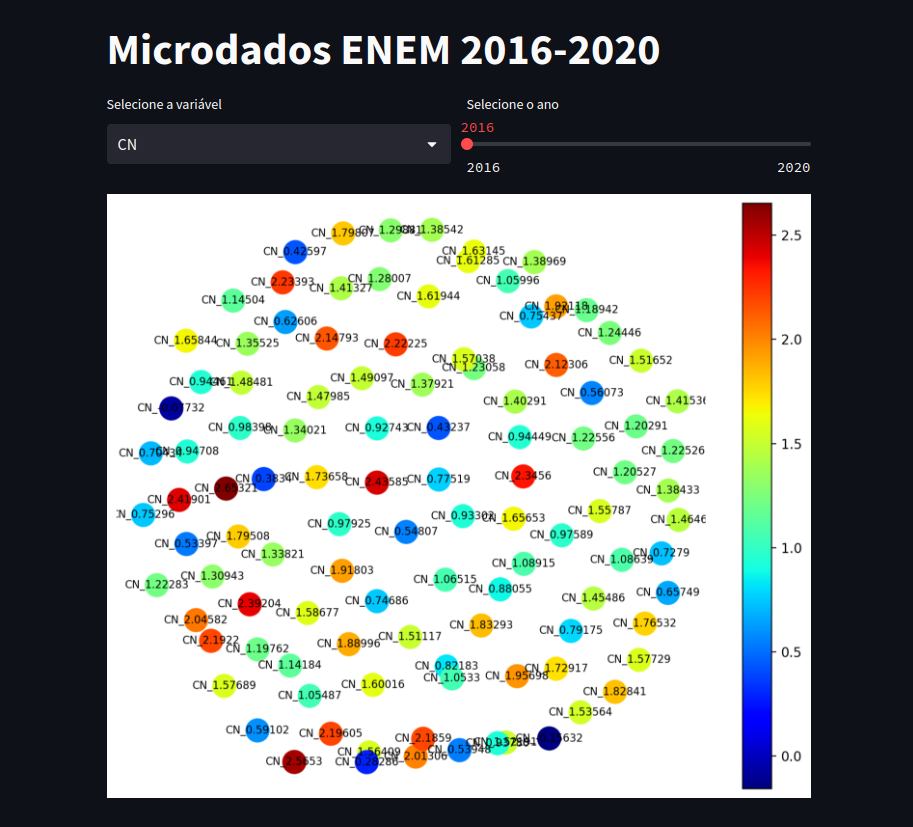

# ENEM Dashboard

## Table of Contents
- [Introduction](#introduction)
- [Features](#features)
- [Installation](#installation)
- [Usage](#usage)
- [Screenshots](#screenshots)
- [Data Sources](#data-sources)
- [Contributing](#contributing)


## Introduction

This dashboard is built using Streamlit and provides an interactive interface to explore ENEM (Exame Nacional do Ensino Médio) data from the years 2016 to 2020. The ENEM is a standardized exam used in Brazil to assess high school students' knowledge and skills, and it plays a significant role in university admissions.

The dashboard allows users to gain insights into various aspects of the ENEM data, including average scores per type of exam and per state, distribution of scores for each exam in a specific year, most common race and age for each state in each year, violin plots depicting the distribution of grades per wealth strat, and difficulty of questions for each year and exam.

## Features
1. The ENEM Dashboard offers the following features:

2. Average Score Visualization: Users can view the average score per type of exam and per state for each year.

3. Distribution of Scores: Users can explore the distribution of scores for each exam in a specific year.

4. Demographic Insights: The dashboard displays the most common race and age group for each state in each year.

5. Violin Plots: Users can analyze the distribution of grades based on different wealth strata using violin plots.

6. Question Difficulty Analysis: The dashboard provides insights into the difficulty of questions for each year and each exam.

7. Score Predictor: The ENEM Dashboard includes a score predictor powered by Multilayer Perceptrons (MLPs). This predictor allows users to estimate their potential scores based on selected parameters. 

## Installation
1. Clone this repository to your local machine or download the ZIP file and extract it.

2. Navigate to the project directory using the command line.

3. Create a virtual environment (optional but recommended).

4. Install the required dependencies using pip:

```
pip install -r requirements.txt

```
5. To ensure the correct display of geo plots, download the file bcim_2016_21_11_2018.gpkg from the official IBGE website: https://www.ibge.gov.br/geociencias/downloads-geociencias.html and store it a folder called 'outils/'.


## Usage
To run the ENEM Dashboard, use the following command in the project directory:
```
streamlit run dashboard.py

```
After running the command, the dashboard will be accessible in your web browser at http://localhost:8501.

## Screenshots
### Average Score Visualization:
<center></center>
<center></center>

### Distribution of Scores:
<center></center>
<center></center>

### Demographic Insights:
<center></center>
<center></center>

### Violin Plots:
<center></center>

### Question Difficulty Analysis:
<center></center>

### Predictor:
<center></center>

## Data Sources
The ENEM data used in this dashboard is sourced from https://www.gov.br/inep/pt-br/acesso-a-informacao/dados-abertos/microdados/enem.

## Contributing
We welcome contributions to improve the ENEM Dashboard. If you find any issues or have suggestions for enhancements, feel free to open an issue or create a pull request.
